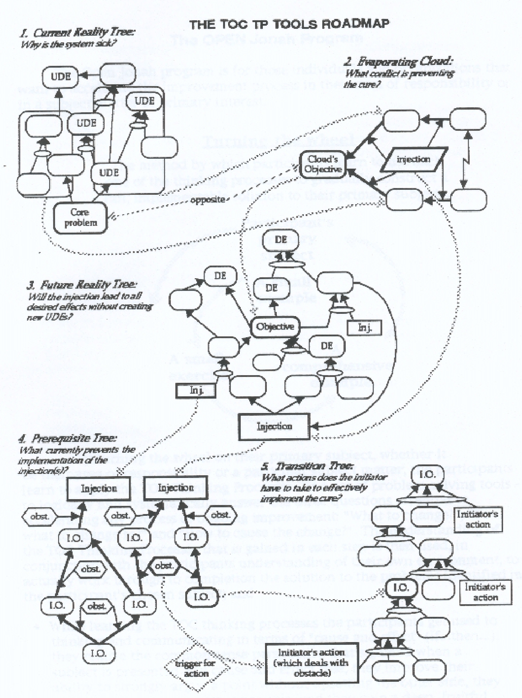
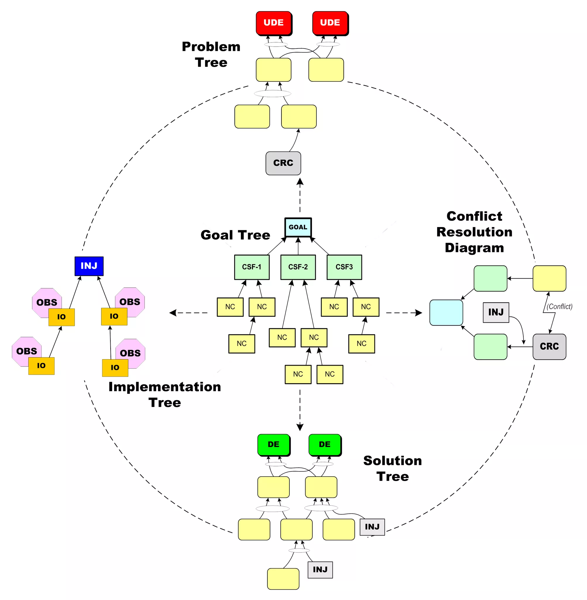

[Dettmer Goldratt's Theory of Constraints Synopsis](https://github.com/msmolyakov/dettmer-goldratts-theory-of-constraints-synopsis)

## Categories of Legitimate Reservation/Критерии Проверки Логических Построений

### CLARITY/Ясность (seeking to understand)
- Необходимы ли дополнительные устные разъяснения?/Would I add any verbal explanation if reading the tree to someone else?
- Понятна ли важность высказывания?
- Являются ли контекст и слова двусмысленными?/Is the meaning/context of words unambiguous?
- Разумна ли связь причины и следствия с точки зрения здравого смысла?/Is the connection between cause and effect convincing “at face value”?
- Пропущены ли промежуточные логические звенья ("длинная стрелка")?/Are intermediate steps missing?

### ENTITY EXISTENCE/Наличие утверждения (complete, properly structured, valid statements of cause or effect)
- Законченное ли предложение?/Is it a complete sentence?
- Имеет ли предложение смысл?/Does it make sense?
- Есть ли скрытое отношение "если-то"?/Is it free of embedded “if-then” statements? (Look for “...because…” and “...in order to….”)
- Содержит ли только одну мысль (не является сложным)?/Does it convey only one idea? (not a compound entity)
- Подтверждается ли на практике?/Does it exist in my (or someone’s) reality?/Can it be documented with evidence?

### CAUSALITY EXISTENCE/Наличие причинно-следственных отношений (logical connection between cause and effect)
- Выполняется ли отношение "если-то"?/Does an “if-then” connection really exist?
- Звучит ли осмысленно при точном прочтении вслух?/Does the proposed cause, in fact, result in the stated effect?
- Does it make sense when read aloud exactly as written?
- Причина очевидна? Если нет - искать другие проявления для проверки./Is the cause intangible? (If so, look for a confirming additional predicted effect)

### CAUSE INSUFFICIENCY/Достаточность приведенной причины (a non-trivial dependent element missing)
- Может ли причина самостоятельно привести к результату?/Can the cause, as stated, result in the effect on its own?
- Есть ли другие существенные факторы для данного явления?/Are any significant causal factors missing?
- Достаточно ли только указанных причин для проявления результата в полном объеме?/Is/are the written cause(s) sufficient to justify all parts of the effect(s)?
- Причины вызывают следствие только в совокупности? ("И")/Is an ellipse required?
- Большинство явлений имеют несколько причин.
- "И" может быть строгим или усиливающим.
- Обычно основных причин не больше 4х, а влиянием остальных можно пренебречь.
- Are any causes that are not really dependent included?

### ADDITIONAL CAUSE/Проверка наличия альтернативной причины (A separate, independent cause producing the same effect)
- Есть ли независимый фактор, который приводит к тому же результату?/Is there anything else that might cause the same effect on its own?
- Если убрать исходную причину, исчезнет ли результат почти полностью? ("ИЛИ")/If the stated cause is eliminated, will the effect be (almost completely) eliminated?
- Альтернатива может оказаться составной ("И") из малых причин.

### CAUSE-EFFECT REVERSAL/Недопустимость подмены причины следствием (Effect misstated as the cause; arrow pointing in the wrong direction.)
- Действительно ли причина вызывает такой результат, а не наоборот?/Is the stated effect really the cause, and the stated effect really the effect?
- Объясняет ли причина, почему существует следствие? Откуда мы узнаем, что оно существует?/Is the stated cause really a reason why, or just how we know the effect exists?

### PREDICTED EFFECT EXISTENCE/Поиск проверочного следствия (additional corroborating effect resulting from the cause)
- Является ли причина неявной?/Is the cause intangible?
- Если связи верны, то у причины еще может быть другое следствие./Do other unavoidable outcomes of the proposed cause exist besides the stated effect?
- Выявленные следствия существуют только одновременно.
- Например, причина не может вызывать и прибыль, и убытки.

### TAUTOLOGY/Отсутствие тавтологии (circular logic)
- Является ли причина явной?/Is the cause intangible?
- Нет зацикливания причины и следствия.
- Is the effect offered as the rationale for the existence of the cause? (for example, “What else could it be?”)
- Are other unavoidable outcomes identifiable besides the proposed effect?

## Diagrams

